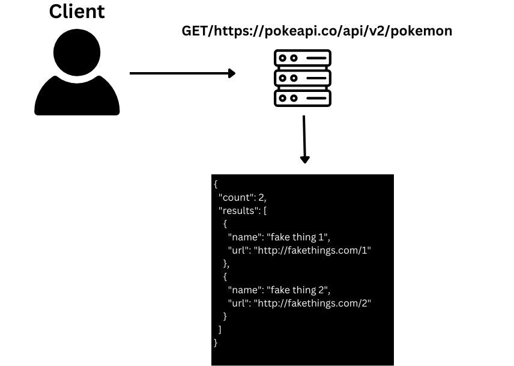

# Resty Application
In its initial development phase, the application seeks to mimic a React web page that interacts with an external API. This interaction involves sending HTTP requests to the API to either fetch or modify data, depending on the specific request made.

---

### UML

### Live URL: [here](https://illustrious-alpaca-f69a7d.netlify.app/)

#### PR : [here](https://github.com/saleh2001k/resty/pull/4)